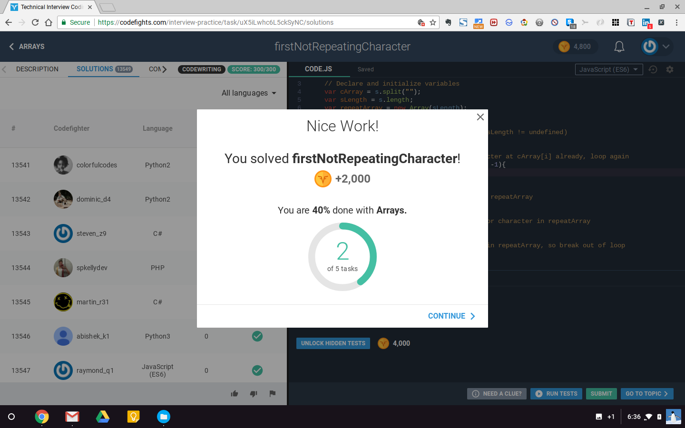

# My second CodeFights challenge
## https://codefights.com/interview-practice/task/uX5iLwhc6L5ckSyNC

#### Note: Write a solution that only iterates over the string once and uses O(1) additional memory, since this is what you would be asked to do during a real interview.

Given a string s, find and return the first instance of a non-repeating character in it. If there is no such character, return '_'.

Example
For s = "abacabad", the output should be
firstNotRepeatingCharacter(s) = 'c'.

There are 2 non-repeating characters in the string: 'c' and 'd'. Return c since it appears in the string first.

For s = "abacabaabacaba", the output should be
firstNotRepeatingCharacter(s) = '_'.

There are no characters in this string that do not repeat.

Input/Output
[time limit] 4000ms (js)
[input] string s

A string that contains only lowercase English letters.

Guaranteed constraints:
1 ≤ s.length ≤ 105.
[output] char
The first non-repeating character in s, or '_' if there are no characters that do not repeat.

[JavaScript (ES6)] Syntax Tips
// Prints help message to the console
// Returns a string

    function helloWorld(name) {
        console.log("This prints to the console when you Run Tests");
        return "Hello, " + name;
    }

